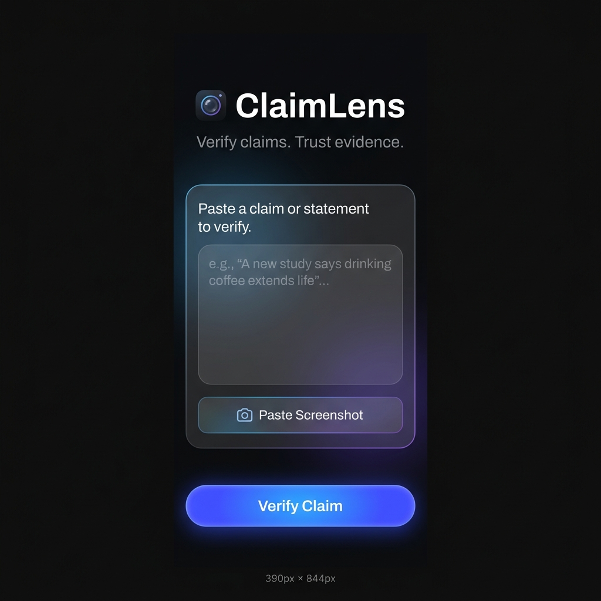
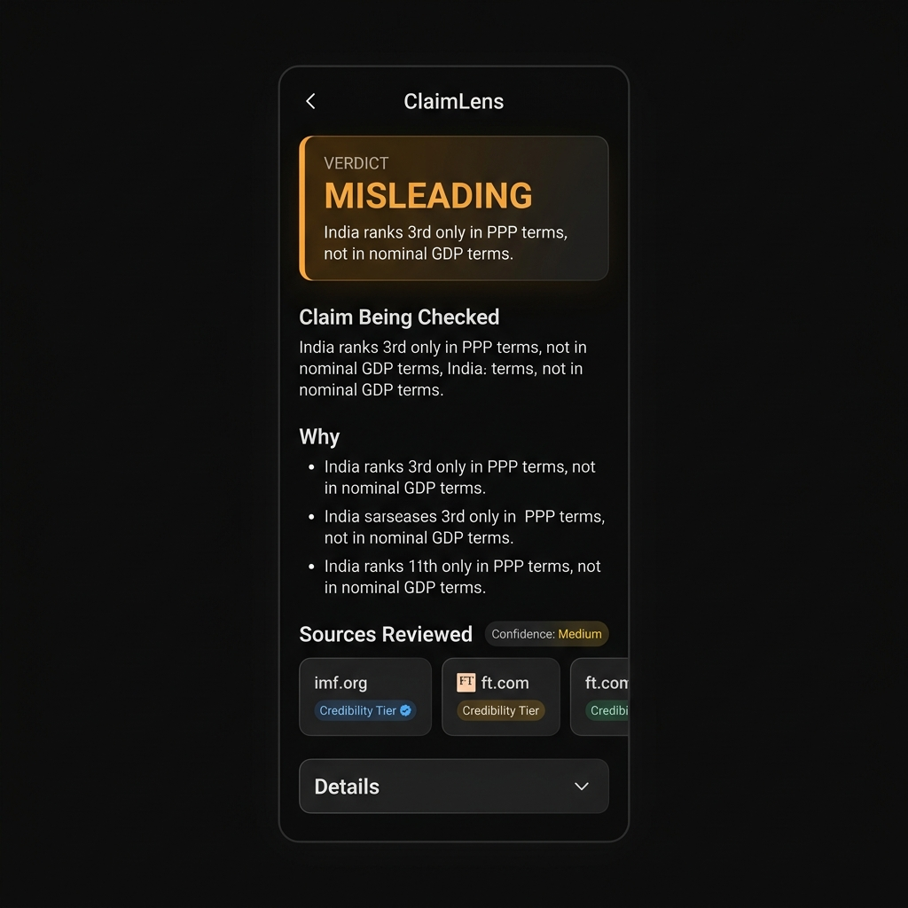
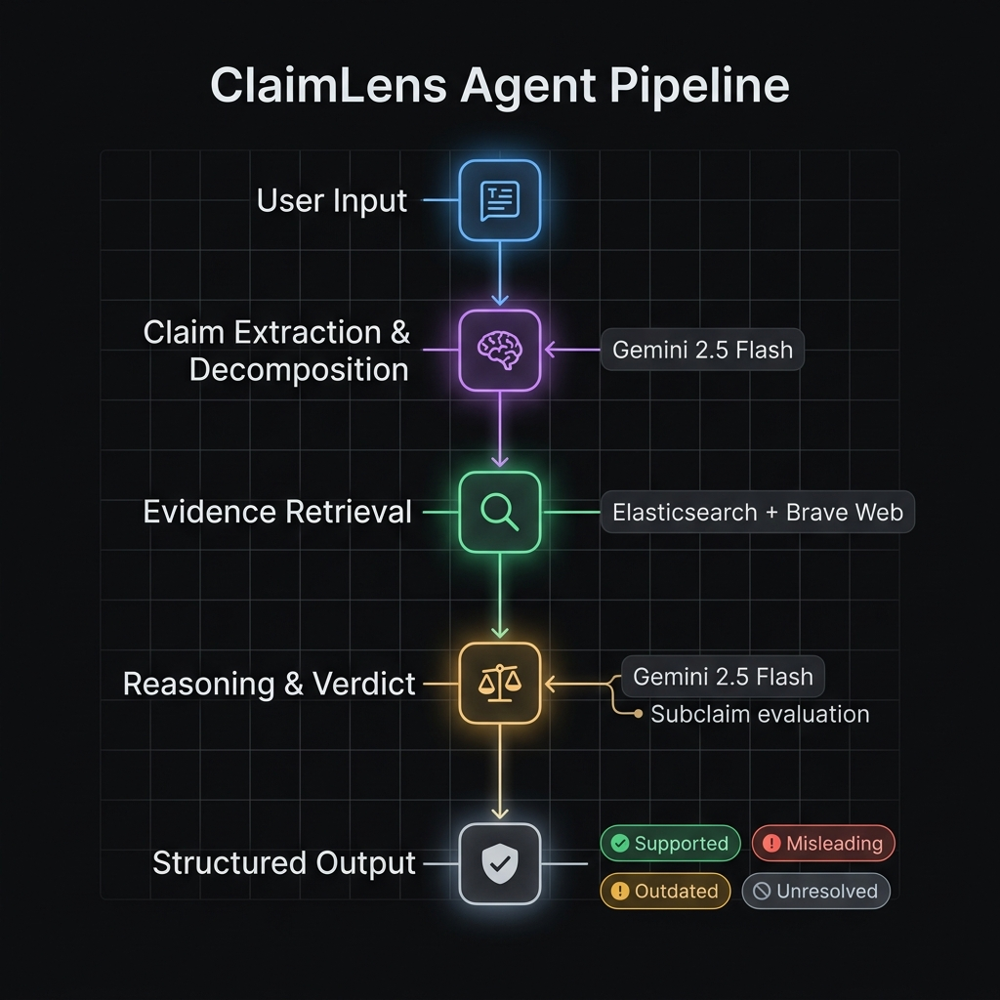

# ClaimLens

**Agentic claim verification — from screenshot or text to structured verdict.**

> 🏆 **Google Cloud Rapid Agent Hackathon Submission**  
> 🔗 **Live Demo:** [https://claimlens.datadeep.de](https://claimlens.datadeep.de)  
> 📁 **Repo:** [https://github.com/diipak/claimlens](https://github.com/diipak/claimlens)

---

## What Is ClaimLens?

ClaimLens is a working agentic fact-checking system that accepts a pasted claim or a screenshot, runs a multi-step reasoning pipeline backed by Vertex AI Gemini, and returns a structured verdict explaining what was verified, against what evidence, and at what confidence level.

It is built for a specific trust problem: viral social media claims and screenshots are routinely labeled as "true" or "false" without any evidence trail. ClaimLens is designed to never produce a confident verdict without independently retrieved, tiered evidence — and to make its reasoning fully transparent to the user.

---

## Why This Is an Agent

ClaimLens does not call a single LLM and return its opinion. It runs a sequential reasoning pipeline with distinct steps, each with a specific purpose:

1. **Perceives input** — accepts raw text or a screenshot image
2. **Extracts a claim** — uses Gemini to identify exactly one verifiable atomic claim and classify it (Numeric, Ranking, Temporal, Mixed)
3. **Decomposes the claim** — breaks it into 2–3 subclaims for independent evaluation (e.g. numerical consistency, source provenance, broader real-world truth)
4. **Retrieves evidence** — queries a curated Elasticsearch index, falls back to Brave Web Search if insufficient, and returns tiered sources
5. **Evaluates and reasons** — a Gemini reasoning call audits each subclaim against evidence using strict provenance rules, applies a Weakest Link verdict principle, and produces a structured JSON response

The system enforces guardrails that prevent overconfident verdicts: if source provenance is unverified, or if only internal arithmetic is confirmed, the verdict is explicitly downgraded.

---

## Agent Pipeline

```
User Input (text or screenshot)
        │
        ▼
┌─────────────────────────────────────────┐
│  Step 1 · OCR (screenshot path only)    │
│  Gemini 2.5 Flash multimodal           │
│  Extracts all text + visual cues        │
└─────────────────┬───────────────────────┘
                  │
                  ▼
┌─────────────────────────────────────────┐
│  Step 2 · Claim Extraction             │
│  Gemini 2.5 Flash (structured JSON)    │
│  → extractedClaim + claimType          │
└─────────────────┬───────────────────────┘
                  │
                  ▼
┌─────────────────────────────────────────┐
│  Step 3 · Claim Decomposition          │
│  Gemini 2.5 Flash (structured JSON)    │
│  → 2–3 atomic subclaims               │
└─────────────────┬───────────────────────┘
                  │
                  ▼
┌─────────────────────────────────────────┐
│  Step 4 · Evidence Retrieval           │
│  Primary:  Elasticsearch (curated)     │
│  Fallback: Brave Web Search API        │
│  Scope tags: Curated / Live Web /      │
│              Hybrid / None             │
└─────────────────┬───────────────────────┘
                  │
                  ▼
┌─────────────────────────────────────────┐
│  Step 5 · Reasoning & Verdict          │
│  Gemini 2.5 Flash (structured JSON)    │
│  Weakest Link Principle                │
│  Provenance gating                     │
│  → verdict + why + confidence +        │
│    warnings + sources                  │
└─────────────────────────────────────────┘
```

**Verdict vocabulary:** `Supported` · `Misleading` · `Projected as current` · `Outdated` · `Unsupported` · `Unresolved`

---

## Screenshots

| Claim Input | Verdict Result | Agent Pipeline |
|---|---|---|
|  |  |  |

*All screenshots show the live app at [claimlens.datadeep.de](https://claimlens.datadeep.de)*

---

## Tech Stack

| Layer | Technology |
|---|---|
| Frontend | React 19 + Vite + TypeScript |
| UI | Vanilla CSS, Hanken Grotesk, mobile-first |
| Backend | Python 3.11 + FastAPI + Uvicorn |
| AI / Reasoning | Google Vertex AI · Gemini 2.5 Flash |
| Multimodal OCR | Gemini 2.5 Flash (image → text) |
| Structured output | Pydantic schema-constrained JSON via `google-genai` SDK |
| Primary evidence store | Elasticsearch (Elastic Cloud Serverless on GCP) |
| Live evidence fallback | Brave Web Search API |
| Local dev fallback | Keyword-ranked local JSON corpus (`database/curated_sources.json`) |
| Frontend hosting | Cloudflare Pages + custom domain |

---

## Google Cloud & Gemini Integration

| Integration | How It Is Used |
|---|---|
| **Vertex AI (us-central1)** | All Gemini API calls route through Vertex AI using Application Default Credentials |
| **Gemini 2.5 Flash** | OCR, claim extraction, claim decomposition, and reasoning — all using structured `response_schema` output |
| **Gemini multimodal** | Screenshots are passed as `types.Part.from_bytes` image parts for OCR extraction |
| **Elastic Cloud (GCP-hosted)** | Curated fact-check source corpus indexed and queried via the official `elasticsearch` Python client |

No mocked API calls. All Gemini calls use the `google-genai` SDK with `vertexai=True`.

---

## Repository Structure

```
claimlens/
├── backend/
│   ├── agent.py              # OCR, claim extraction, decomposition, reasoning
│   ├── main.py               # FastAPI app, /api/verify endpoint
│   ├── search.py             # Elasticsearch + Brave Web fallback retrieval
│   ├── prompts.py            # System prompts for each agent step
│   ├── schema.py             # Pydantic response schema (VerificationResponse)
│   ├── requirements.txt
│   └── .env.example
├── frontend/
│   ├── src/
│   │   ├── App.tsx           # Main React app
│   │   ├── App.css           # Component styles
│   │   └── index.css         # Design tokens, typography
│   ├── package.json
│   └── vite.config.ts
├── database/
│   └── curated_sources.json  # Local fallback evidence corpus
├── scripts/
│   ├── test-scenarios.py     # Integration test suite (7 scenarios)
│   └── seed-elastic.py       # Elasticsearch index seeding script
├── docs/
│   ├── architecture.md
│   ├── hackathon-submission.md
│   ├── demo-script.md
│   └── screenshots/
├── .npmrc                    # legacy-peer-deps for Cloudflare Pages
└── README.md
```

---

## Local Setup

### Prerequisites
- Python 3.10+
- Node.js 18+
- Google Cloud CLI authenticated:
  ```bash
  gcloud auth application-default login
  ```

### 1. Backend

```bash
# From project root
cd backend
python3 -m venv .venv
source .venv/bin/activate          # Windows: .venv\Scripts\activate
pip install -r requirements.txt

# Create .env from template
cp .env.example .env
# Edit .env with your GCP project and optional Elastic credentials
```

```env
# backend/.env
GOOGLE_CLOUD_PROJECT=your-gcp-project-id
GOOGLE_CLOUD_LOCATION=us-central1
REASONING_MODEL=gemini-2.5-flash

# Optional: enables Elasticsearch retrieval instead of local fallback
ES_URL=https://your-deployment.es.us-central1.gcp.elastic-cloud.com
ES_API_KEY=your-elastic-api-key

# Optional: enables live web fallback via Brave Search
BRAVE_API_KEY=your-brave-api-key
```

```bash
# Start backend (from project root)
backend/.venv/bin/python -m uvicorn backend.main:app --host 0.0.0.0 --port 8000
```

Backend API runs at `http://localhost:8000`. Health check: `GET /api/health`.

### 2. Frontend

```bash
cd frontend
npm install
npm run dev
```

Frontend runs at `http://localhost:5173`.

> The frontend's `VITE_API_URL` defaults to `http://localhost:8000`. For production, set it to your deployed backend URL.

---

## Elasticsearch Setup (Optional)

Without Elastic credentials, the backend uses a local keyword-ranked fallback corpus. To enable full Elasticsearch retrieval:

1. Create an [Elastic Cloud](https://cloud.elastic.co/) deployment (GCP region recommended)
2. Add `ES_URL` and `ES_API_KEY` to `backend/.env`
3. Seed the curated source index:
   ```bash
   cd backend && python ../scripts/seed-elastic.py
   ```

---

## Integration Tests

A 7-scenario integration test suite verifies the full pipeline:

```bash
# With backend running at :8000
python scripts/test-scenarios.py
```

Test scenarios include:
- Future projection framed as current fact → expects `Projected as current`
- GDP nominal vs PPP ranking mismatch → expects `Misleading`
- Outdated inflation data in screenshot → expects `Outdated`
- Demo Mode loud-fail (missing Elastic credentials) → expects HTTP 500
- Graceful fallback on unknown claim → expects `Unresolved`
- Zero-evidence claim → expects `Unresolved` with scope `None`
- Live web fallback verification → expects `Live Web` scope

---

## Deployment

| Component | Hosting |
|---|---|
| Frontend | Cloudflare Pages |
| Custom domain | `claimlens.datadeep.de` |
| Backend | Self-hosted / local (backend API not yet publicly hosted) |

> **Note:** The live demo frontend at `claimlens.datadeep.de` connects to a backend. For full end-to-end verification, run the backend locally and point the frontend at it, or see `docs/hackathon-submission.md` for the demo configuration.

---

## Current Limitations

- The curated evidence corpus covers a small set of illustrative scenarios (economic rankings, metro expansion, inflation data). Claims outside this scope rely on Brave Web Search live fallback.
- The backend must be run locally — there is no publicly hosted backend API endpoint at this time.
- Screenshot OCR quality depends on image resolution and text clarity.
- No authentication or rate limiting is implemented (this is a hackathon prototype).

---

## Future Improvements

- Expand the curated evidence corpus with more real-world fact-check scenarios
- Deploy the backend API to Cloud Run or a similar managed platform
- Add support for multi-claim documents (currently extracts one primary claim)
- Add citation linking between verdict bullets and specific source passages
- Add a timeline view showing how a claim has changed over time across evidence

---

## Docs

- [Architecture](docs/architecture.md) — detailed system design and data flow
- [Hackathon Submission](docs/hackathon-submission.md) — submission elevator pitch and description
- [Demo Script](docs/demo-script.md) — 2–3 minute video walkthrough script

---

## License

MIT — see [LICENSE](LICENSE)
