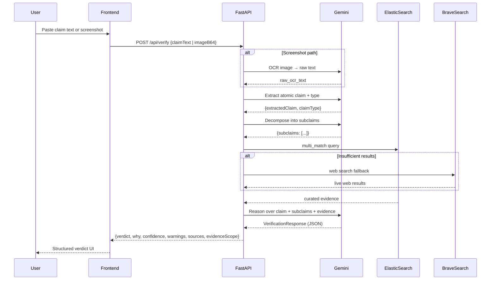

# ClaimLens — Architecture

## Overview

ClaimLens is a sequential agentic pipeline built on top of Vertex AI Gemini. Each user request passes through five distinct stages: input resolution, claim extraction, claim decomposition, evidence retrieval, and reasoning. No stage is skipped.

The system is implemented as a FastAPI backend (`backend/`) that orchestrates all agent calls, and a React/Vite frontend (`frontend/`) that handles user interaction and result rendering.

---

## System Layers

```
┌────────────────────────────────────────────────────────┐
│                    Frontend (React + Vite)              │
│  - Claim text input                                    │
│  - Screenshot upload (base64)                          │
│  - Verdict display: verdict, why, sources, confidence  │
│  - Mobile-first, dark-themed, glassmorphism UI         │
│  Hosted: Cloudflare Pages · claimlens.datadeep.de      │
└──────────────────────────┬─────────────────────────────┘
                           │ POST /api/verify
                           ▼
┌────────────────────────────────────────────────────────┐
│               Backend Agent Layer (FastAPI)             │
│  backend/main.py — request routing and orchestration   │
│  backend/agent.py — Gemini agent calls                 │
│  backend/search.py — evidence retrieval routing        │
│  backend/prompts.py — system prompts per step          │
│  backend/schema.py — Pydantic response contract        │
└──────────────────────────┬─────────────────────────────┘
                           │
          ┌────────────────┼──────────────────┐
          ▼                ▼                  ▼
┌──────────────┐  ┌───────────────┐  ┌───────────────────┐
│ Vertex AI    │  │ Elasticsearch │  │ Brave Web Search  │
│ Gemini 2.5   │  │ Elastic Cloud │  │ API (live web     │
│ Flash        │  │ (GCP-hosted)  │  │ fallback)         │
│              │  │               │  │                   │
│ OCR          │  │ curated-      │  │ Returns top-5     │
│ Extraction   │  │ sources index │  │ results, tiered   │
│ Decomp.      │  │ multi_match   │  │ by domain         │
│ Reasoning    │  │ query         │  │ (gov/edu = Tier1) │
└──────────────┘  └───────────────┘  └───────────────────┘
                           │
                           ▼
              ┌────────────────────────┐
              │  Local JSON Fallback   │
              │  database/             │
              │  curated_sources.json  │
              │  (keyword-ranked)      │
              └────────────────────────┘
```

---

## Agent Step Detail

### Step 1 — Input Resolution & OCR

**File:** `backend/agent.py` → `ocr_screenshot()`  
**Triggered:** Only when `imageB64` is present in the request payload  
**Model:** Gemini 2.5 Flash (multimodal)  

The image bytes are passed as `types.Part.from_bytes(data=image_bytes, mime_type=mime_type)` alongside a precise OCR prompt. The model returns all readable text and any visible metadata cues (logos, URLs, dates). This raw OCR text becomes the input for claim extraction.

```python
image_part = types.Part.from_bytes(data=image_bytes, mime_type=mime_type)
response = client.models.generate_content(
    model="gemini-2.5-flash",
    contents=[prompt, image_part]
)
```

---

### Step 2 — Claim Extraction

**File:** `backend/agent.py` → `extract_claim_from_text()`  
**Model:** Gemini 2.5 Flash (structured JSON output via `response_schema`)

The model receives the raw text (or OCR output) and returns exactly one atomic verifiable claim plus its type classification (`Numeric`, `Ranking`, `Temporal`, `Mixed`). Output is constrained by a Pydantic schema, eliminating free-text hallucination risk.

```python
response = client.models.generate_content(
    model="gemini-2.5-flash",
    contents=raw_text,
    config=types.GenerateContentConfig(
        system_instruction=CLAIM_EXTRACTION_PROMPT,
        response_mime_type="application/json",
        response_schema=ExtractedClaimResult
    )
)
```

---

### Step 3 — Claim Decomposition

**File:** `backend/agent.py` → `decompose_claim()`  
**Model:** Gemini 2.5 Flash (structured JSON output)

For screenshot-based and social media claims, the model decomposes the claim into 2–3 atomic subclaims that must each be verified independently:

- **(a) Numerical/visual consistency** — does the visible data add up?
- **(b) Source provenance** — is the origin of the data independently verified?
- **(c) Broader real-world truth** — does the conclusion hold against external authoritative evidence?

This decomposition is passed to the reasoning step, where each subclaim is evaluated separately.

---

### Step 4 — Evidence Retrieval

**File:** `backend/search.py` → `retrieve_evidence()`

Evidence is retrieved in a tiered priority order:

| Priority | Source | Condition |
|---|---|---|
| 1 | Elasticsearch (`curated-sources` index) | `ES_URL` + `ES_API_KEY` set |
| 2 | Local JSON corpus (keyword-ranked) | Elasticsearch not configured or fails |
| 3 | Brave Web Search API | Curated results < 3 |

Results are tagged with a `scope` label (`Curated`, `Live Web`, `Hybrid`, `None`) that is included in the final response so users know what evidence tier was used.

Each source is also assigned a credibility tier:
- **Tier 1 (Primary):** `.gov`, `.edu`, `imf.org`, `who.int`, `worldbank.org`, etc.
- **Tier 2 (Secondary):** `bbc.com`, `reuters.com`, `apnews.com`, `bloomberg.com`, etc.
- **Tier 3 (Context):** All other sources

---

### Step 5 — Reasoning & Verdict

**File:** `backend/agent.py` → `verify_claim_against_evidence()`  
**Model:** Gemini 2.5 Flash (or `gemini-2.5-pro` if `REASONING_MODEL` env var overrides)  
**Output schema:** `VerificationResponse` (Pydantic)

The model receives the extracted claim, the decomposed subclaims, and the formatted evidence block including provenance ratings for each source. It applies strict verdict gating rules:

**Weakest Link Principle:** The overall verdict reflects the weakest verified subclaim. If any subclaim is unverified, the verdict cannot be `Supported`.

**Provenance Gating:** Sources that are social media posts, screenshots of the original claim, or articles merely citing the original post are marked as low provenance. If evidence consists only of these, the verdict must be `Unresolved` or `Unsupported`.

**Arithmetic vs. Real-World Gating:** If only internal arithmetic is confirmed (numbers inside a screenshot add up) but the broader claim is not independently verified, the verdict must not be `Supported`.

---

## Data Flow Diagram



---

## Response Schema

```python
class VerificationResponse(BaseModel):
    extractedText: Optional[str]   # Raw OCR text (screenshot path only)
    extractedClaim: str            # The atomic claim that was verified
    claimType: str                 # Numeric | Ranking | Temporal | Mixed
    verdict: str                   # Supported | Misleading | Projected as current
                                   # Outdated | Unsupported | Unresolved
    why: List[str]                 # 2–4 evidence-grounded explanation bullets
    confidence: str                # Low | Medium | High
    warnings: List[str]            # Methodological warnings
    sources: List[Source]          # Evidence sources with tier, domain, URL, snippet
    evidenceScope: str             # Curated | Live Web | Hybrid | None
```

---

## Environment Variables

| Variable | Required | Description |
|---|---|---|
| `GOOGLE_CLOUD_PROJECT` | Yes | GCP project ID for Vertex AI |
| `GOOGLE_CLOUD_LOCATION` | Yes | Region (e.g. `us-central1`) |
| `REASONING_MODEL` | No | Gemini model (default: `gemini-2.5-flash`) |
| `ES_URL` | No | Elasticsearch endpoint URL |
| `ES_API_KEY` | No | Elasticsearch API key |
| `BRAVE_API_KEY` | No | Brave Web Search API key |
